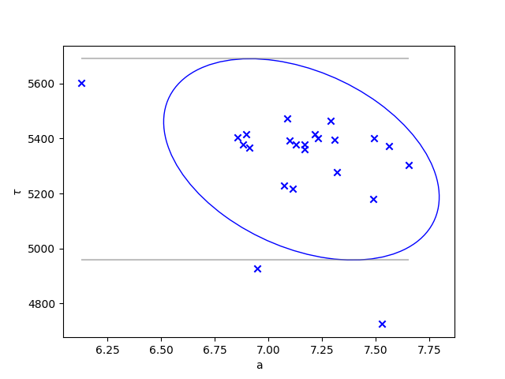

# BeamGasAnalysis
In the CERN accelerator complex the ion beams suffer from losses. In this repository we study the losses coming from interactions between the ion beams and residual gas molecules. These effects is modelled by the rest gas collision cross section, which consists of electron loss (EL) cross section, and electron capture (EC) cross section. Hence, we have $\sigma = \sigma_{EC} + \sigma_{EL}$. The EL cross section is calculated using a semi-emperical formula combining the studies from [^1] and [^2]. The EC is calculated using the Schlachter formula[^3]. 

The cross section is inversely proportional to the lifetime of an ion in the following sense, [^4]

$$
\tau = \frac{1}{\beta  c\sigma n},
$$

where $\beta$ is the relativistic beta ($\beta=v/c$ with $v$ being the velocity of the ion), $c$ is the speed of light, $\sigma$ is the combined EL and EC cross section, and $n$ is the molecular density of the gas in the beam pipe. Hence, it is relatively simple to go from cross section estimates to lifetime estimates and vica versa. From beam data it is also possible to estimate a lifetime for a given ion. This is done with the following beam intensity formula,

$$
I(t) = a\ \text{e}^{-bt},
$$

where $\tau = 1/b$ is the lifetime of the ion, and $a$ is a constant. By fitting this formula to the beam data, we can estimate the lifetime of the ion.

## Table of Contents
1. [Installation](#installation)] 
2. [Data](#data)
    1. [Data Import](#dataimport)
3. [Usage](#usage)
4. [Results](#results)

## Installation <a name="installation"></a>
The package can be installed in editable mode by running the following command in the terminal:

```bash
git clone https://github.com/jako4295/BeamGasAnalysis.git
pip install .
```

## Data <a name="data"></a>
The data used for processing is found in the `DataHandler`, and the data is stored in the `DataObject` class. This class contains the following: 
- `gas_fractions`, which is percentage of the different gases in the beam pipe (also referred to as residual gasses). 
- `pressure_data`, which is the pressure in the beam pipe. It is assumed that the pressure is constant in the beam pipe.
- `projectile_data`, which constists of the atomic number $Z$, the charge $q$, the kinetic energy $E_{kin}$, the first ionization potential of the projectile $I_p$, the principle quantum number of the outermost projectile electron $n_0$, and the relativistic beta $\beta$. The projectile is the term used for the ion beam.
  - $I_p$ is found using the [NIST database](https://physics.nist.gov/PhysRefData/ASD/ionEnergy.html) and converting the value for ionization energy to keV.
  - $n_0$ is found by sorting the electron configuration in ascending order according to the energy level of the atom in question. The energy level order can be found [here](https://chem.libretexts.org/Bookshelves/General_Chemistry/Map%3A_A_Molecular_Approach_(Tro)/08%3A_Periodic_Properties_of_the_Elements/8.03%3A_Electron_Configurations-_How_Electrons_Occupy_Orbitals) in Figure 8.3.1. Starting from the highest energies then we remove from the superscript. For instance the electron configuration for oxygen is $1s^2 2s^2 2p^4 \ \Rightarrow \ 1s^2 2s^2$, which gives $n_0=2$ (because this is the energy level $2s$). 
- `elements`, which is the beam data and is used to find the lifetime of an ion through fitting of the exponential function given above.
### Data Import <a name="dataimport"></a>
To initiate the `DataObject` there are a few options, as showed in code below:

*Initiate from file path*
```python
from DataHandler import DataObject

ring_type = "PS"
path = "DataHandler/"
data = DataObject(
    ring_type=ring_type,
    gas_fraction=path + "Gas_fractions.csv",
    pressure=path + "Pressure_data.csv",
    projectile=path + "Projectile_data.csv",
)
```
*Initiate from pandas series*
```python
from DataHandler import DataObject

ring_type = "PS"
gas_fraction = pd.read_csv("DataHandler/Gas_fractions.csv", index_col=0, squeeze=True)
pressure = pd.read_csv("DataHandler/Pressure_data.csv", index_col=0, squeeze=True)
projectile = pd.read_csv("DataHandler/Projectile_data.csv", index_col=0, squeeze=True)
data = DataObject(
    ring_type=ring_type,
    gas_fraction=gas_fraction,
    pressure=pressure,
    projectile=projectile,
)
```
If it is desired to run tests with data from the beams then we can use the `get_data` attribute or initialize the `DataObject` with the `beam_data` parameter set to the path to the data. Here are the two options showed in code:

*Initiate using attribute*
```python
from DataHandler import DataObject

ring_type = "PS"
path = "DataHandler/"
data = DataObject(
    ring_type=ring_type,
    gas_fraction=path + "Gas_fractions.csv",
    pressure=path + "Pressure_data.csv",
    projectile=path + "Projectile_data.csv",
)
data_path = path + "BeamDataHandler/"
data.get_data(data_path)
```
*Initiate using parameter*
```python
from DataHandler import DataObject

ring_type = "PS"
path = "DataHandler/"
data = DataObject(
    ring_type=ring_type,
    gas_fraction=path + "Gas_fractions.csv",
    pressure=path + "Pressure_data.csv",
    projectile=path + "Projectile_data.csv",
    beam_data=path + "BeamDataHandler/"
)
```


## Usage <a name="usage"></a>
The different methods that has been developed for this project is found in the `Calculator` class. The methods are described below.

We can calculate the cross section as follows (note that the `data` is the `DataObject` described above):

```python
from Calculator import Calculator

calculator_object = Calculator(data)
sigma_el, sigma_ec = calculator_object.get_all_molecular_sigmas()
```
We can calculate the lifetime as follows (note that the `data` is the `DataObject` described above):

```python
from Calculator import Calculator

calculator_object = Calculator(data)
tau = calculator_object.calculate_full_lifetime()
```
If we have loaded the data to the `DataObject` (see [Data](#data)) then we can calculate the lifetime from the beam data as follows:

```python
from Calculator import Calculator

calculator_object = Calculator(data)
tau = calculator_object.get_lifetime_from_data(
    injection_idx=270,
    extraction_idx=1500,
)
```
The `injection_idx` and `extraction_idx` are the indices of the beam data where the injection and extraction of the beam starts, respectively. This is based on the fitting of the beam intensity formula to the beam data. The indices are found by looking at the plot of the beam data and finding the indices where the injection and extraction starts. 

From the lifetime we can obtain the cross section. Note this cross section is the combined cross section for electron loss and electron capture. This is done as follows:

```python
sigma_from_tau = calculator_object.get_sigma_from_lifetime(tau)
```

## Results <a name="results"></a>
All code is run from the file `Executor.py` found in the `LifetimeExecutor`, where different plots are made from the `Tests` class. The current methods implemented in the `Tests` class is explained below. For a description of the data used, see the section [Data](#data).

### `Tests.get_lifetimes_from_sigma_estimates()`
This method calculates a lifetime for a given ring type (LEIR, PS, or SPS). The estimated cross sections are calculated using the methods referred to above [^1][^2][^3]. The lifetimes are calculated using the inversely proportional relation between lifetime and cross section. The plot that is obtained using this method is shown below (for PS).


### `Tests.get_sigma_estimates_with_varying_i_p()`
This method calculates the cross section for a given ring type (LEIR, PS, or SPS). The cross sections are calculated using the methods referred to above [^1][^2][^3]. The cross sections are calculated for different ionization potentials $I_p$ to see the impact of this paremeter.


### `Tests.get_sigma_estimates_with_varying_n_0()`
This method calculates the cross section for a given ring type (LEIR, PS, or SPS). The cross sections are calculated using the methods referred to above [^1][^2][^3]. The cross sections are calculated for different principle quantum numbers $n_0$ to see the impact of this paremeter.


### `Tests.get_lifetime_from_data()`
This method gets an estimate of the lifetime based on the beam data from `DataObject().elements`. The lifetime is estimated by fitting the beam intensity formula to the beam data. This lifetime is then compared to the cross section estimates in the cross section domain. Note that when the lifetime is found from the cross section then from the inverse proportionality we have an $n$ for each residual gas in the beam pipe. Hence we have a cross section comparison for each residual gas.

From the data we get multiple cycles of the same experiment for each bunch of particles we insert into the beam pipe. Hence, we get a parameter fit for each bunch. This is used to create a confidence ellipse for the parameters as shown below (for PS).



The gray bounds drawn on the figure above illustrates the upper and lower bounds for the lifetime parameter of the model, which is the one we are interested in. The confidence ellipse is created using two standard deviations, which is approximately equivalent to a 95% confidence interval. To use the function for creating this ellipse then we can from the `Executor.py` file run the following code,

```python
from LifetimeExecutor import StatisticalSummary

StatisticalSummary.plot_confidence_ellipse(np.random.normal(7,0.5,500), np.random.normal(5,1,500))
```
This will create create an ellipse similar to the one above. The first parameter is the fit for the a parameter of the beam intensity formula, and the third parameter is the fit for the $\tau$ parameter of the beam intensity formula. Furthermore, this function is a wrapper function for the one described [here](https://matplotlib.org/stable/gallery/statistics/confidence_ellipse.html). The wrapper adds everything to the plot, except the ellipse. The heat map is based one the squared residuals to the average fitted parameters. To follow an example with a similar heat map, see [here](https://scipython.com/blog/least-squares-fitting-to-an-exponential-function/#comments).

To compare this best and worst case lifetime estimate to the cross section estimates we plot the cross section estimates with the best and worst case lifetime estimates, together with semi-emperical formula for cross section that is descibed in [^1][^2][^3]. This is shown below (for PS).


[^1]: [DuBois et al. Electron capture cross section](https://journals.aps.org/pra/abstract/10.1103/PhysRevA.84.022702)
[^2]: [Shevelko et al. Electron loss cross section](https://www.sciencedirect.com/science/article/pii/S0168583X11003272)
[^3]: [Schlachter Formula. Electron loss cross section](https://journals.aps.org/pra/abstract/10.1103/PhysRevA.27.3372)
[^4]: https://cds.cern.ch/record/902810/files/at-2005-013.pdf
